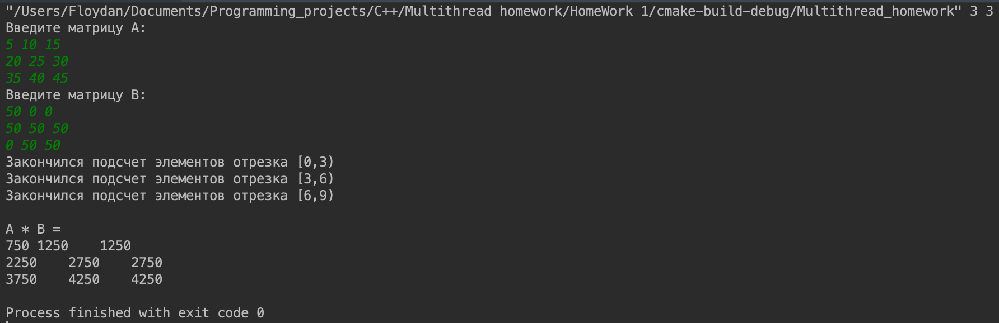
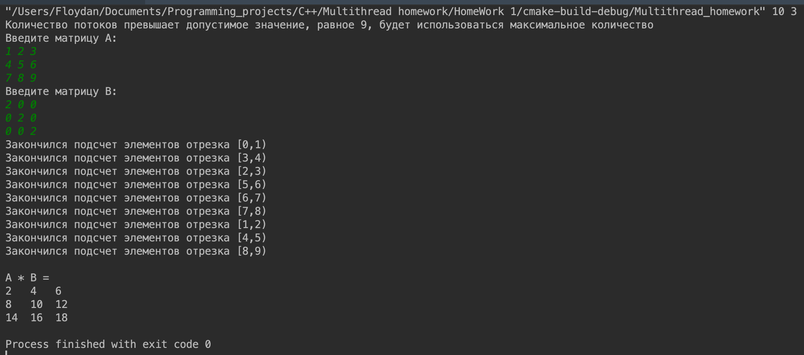
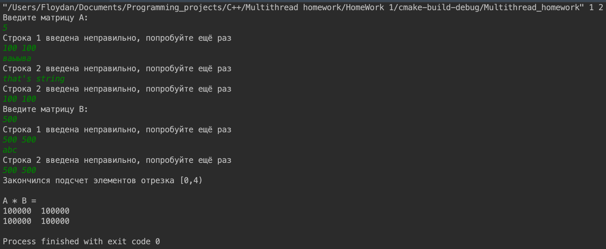
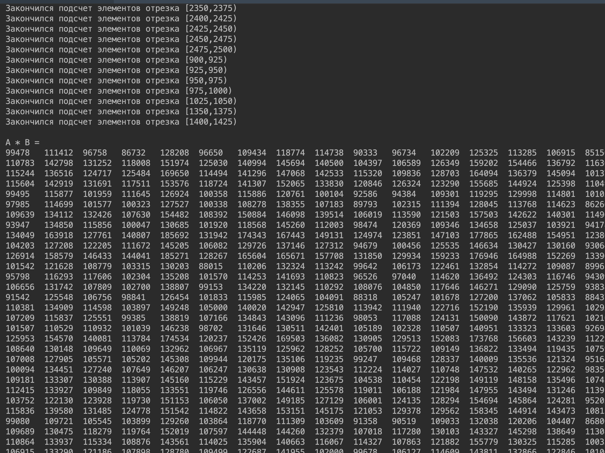

# Задание №3

## Условие задания (вариант №1)

> Вычислить векторное произведение квадратных матриц `А` и `B`.
Входные данные: произвольные квадратные матрицы `А` и `В` одинаковой
размерности. Размер матриц задается входным параметром. Количество
потоков является входным параметром, при этом размерность матриц может
быть не кратна количеству потоков.

## Отчёт о работе

[Код программы](main.cpp)

Программа выполнена в виде консольного приложения. Ввод осуществляется через консоль, в качестве аргументов командной строки передаются количество потоков и размер матриц. 

Реализация основана на **итеративном параллелизме**. Каждый поток отвечает за подсчет своей части матрицы, притом все эти части, кроме, иногда, последней, одникового размера.

## Тестирование программы

1. Стандартный ввод
   

1. Стандартный ввод, но количество потоков больше максимального
   
   В данном случае программа будет работать с максимальным допупустимым количеством потоков, который зависит от размера матрицы

1. Неверный ввод строки
   
   Ввод строки матрицы происходит, пока она не будет содержать хотя бы 2 целых числа

1. Ввод больших случайных матриц 50x50
   
   К сожалению, тест не умещается в скриншот, однако обрабатывается верно